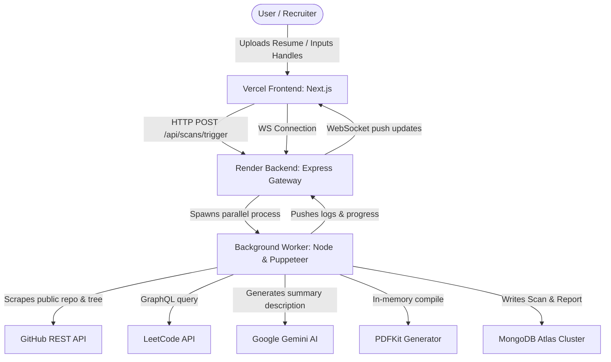

<div align="center">
  
  <h1>UrScore AI</h1>
  <p><strong>Stateless Parallel Analysis Scanner & Verification Engine</strong></p>
  <p>Cross-reference public codebase commits with PDF resumes to prevent skill spoofing and verify true technical competency.</p>

  <p>
    <a href="https://urscore-ai.vercel.app/" target="_blank">
      
    </a>
    <a href="https://urscore-backend.onrender.com/api/health" target="_blank">
      
    </a>
  </p>
</div>

---

## 🎯 Overview

**UrScore AI** is a state-of-the-art developer evaluation platform designed to combat "skill spoofing" in tech hiring. Rather than simply scanning a resume for keywords, UrScore AI autonomously scrapes, parses, and cross-references a candidate's uploaded resume against their actual, verifiable **GitHub codebase** and **LeetCode statistics**. 

The engine produces a mathematically rigorous **Competency Score** and evaluates candidate true proficiency using AI architecture analysis, delivering results via a stunning 3D Web Dashboard and a generated, shareable PDF Report.

* **Production Frontend**: [https://urscore-ai.vercel.app/](https://urscore-ai.vercel.app/)
* **Production API Gateway**: [https://urscore-backend.onrender.com/](https://urscore-backend.onrender.com/)

---

## 🏗️ System Architecture & Connection Flow

The platform utilizes a modern, distributed services model designed to run on free-tier cloud architectures:



### 1. Frontend (`/frontend`) — Hosted on Vercel
* Built with **Next.js 14** and **Tailwind CSS**.
* Provides a glassmorphic upload dashboard where users import PDF/TXT resumes and input GitHub & LeetCode usernames.
* Establishes a WebSocket connection (`wss://`) to the Render backend to stream telemetry logs and checklist progress updates in real time.
* Handles client-side rendering of the finalized 3D medals (Elite, Gold, Silver, Bronze) and dynamic Recharts transaction graphs.

### 2. Backend API Gateway (`/backend`) — Hosted on Render
* Built with **Express.js** and **WebSockets (`ws`)**.
* Acts as the orchestrator. It parses the uploaded PDF resume text, stores a pending scan entry in MongoDB Atlas, and spawns the background worker process.
* Maintains client WebSocket sessions to stream real-time logs (`[SYSTEM] Ingesting...`) directly from the worker.

### 3. Background Worker (`/worker`) — Spawned by Backend
* The analysis engine. Runs as an asynchronous, stateless process.
* **Resume Parsing**: Extracts languages, frameworks, databases, and tools.
* **GitHub Crawling**: Queries repository data, commits, and recursively inspects codebase tree hierarchies to locate package dependencies (`package.json`, `requirements.txt`, etc.).
* **AI Codebase Assessment**: Sends dependency lists and directory structures to the **Gemini 2.5 Flash** model to generate a concise, 2-sentence architectural summary of the project.
* **Scoring Algorithm**: Factors in commit message quality, repository complexity, activity consistency, and keyword cross-referencing to output a score out of 100.
* **PDF Kit Compiler**: Generates a PDF scorecard in-memory and saves it locally on the server (copied directly to backend public reports for client download) or uploads it to AWS S3.

---

## 🏅 Medal Tier System

Based on the final Composite Score (0-100), candidates are awarded a rank:
* **🏆 ELITE** (> 85 Score) — Glowing Fuchsia Medallion
* **🥇 GOLD** (> 70 Score) — Golden Amber Medallion
* **🥈 SILVER** (> 60 Score) — Slate Gray Medallion
* **🥉 BRONZE** (> 50 Score) — Deep Orange Medallion

---

## ⚙️ Environment Variables Config

### Backend (`/backend/.env` & Render Environment)
```env
PORT=5001
MONGO_URI=mongodb+srv://...
GEMINI_API_KEY=your_gemini_api_key
GITHUB_TOKEN=your_github_personal_access_token

# Optional AWS integrations
AWS_ACCESS_KEY_ID=your_aws_key
AWS_SECRET_ACCESS_KEY=your_aws_secret
AWS_REGION=us-east-1
AWS_S3_BUCKET=your_bucket_name
AWS_SES_SENDER=your_verified_ses_email
```

### Frontend (`/frontend/.env` & Vercel Environment)
```env
NEXT_PUBLIC_API_URL=https://urscore-backend.onrender.com
```

---

## 🚀 Deployment Workflows

### 💻 Local Development
1. **Bootstrap Monorepo**: Install all sub-project dependencies from the root directory:
   ```bash
   npm run bootstrap
   ```
2. **Start Dev Servers**: Spin up both servers concurrently:
   ```bash
   npm run dev
   ```
   * Frontend will listen on: `http://localhost:3000` (or `3001` if port 3000 is occupied).
   * Backend API will listen on: `http://localhost:5001`.

### 🌐 Vercel Deployment (Frontend)
1. Import the project repository on Vercel.
2. Set the **Root Directory** to `frontend`.
3. Set the **Framework Preset** to `Next.js`.
4. Configure the environment variable: `NEXT_PUBLIC_API_URL` pointing to your live backend.
5. Deploy!

### ☁️ Render Deployment (Backend & Worker)
1. Create a new **Web Service** on Render and link the repository.
2. Leave the **Root Directory** blank (very important, so the backend can access the sibling `/worker` folder).
3. Set the **Build Command**:
   ```bash
   npm install && npm run install-backend && npm run install-worker && npm run build --prefix backend
   ```
4. Set the **Start Command**:
   ```bash
   node backend/dist/server.js
   ```
5. Add your environment variables in the Render dashboard and deploy!
